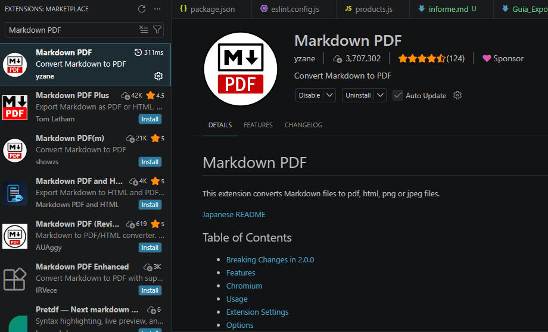
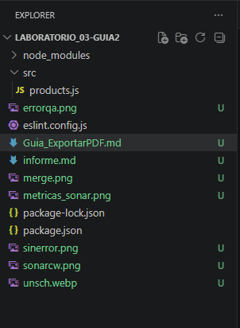
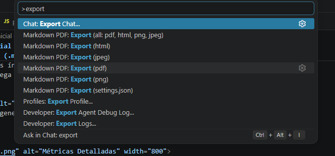
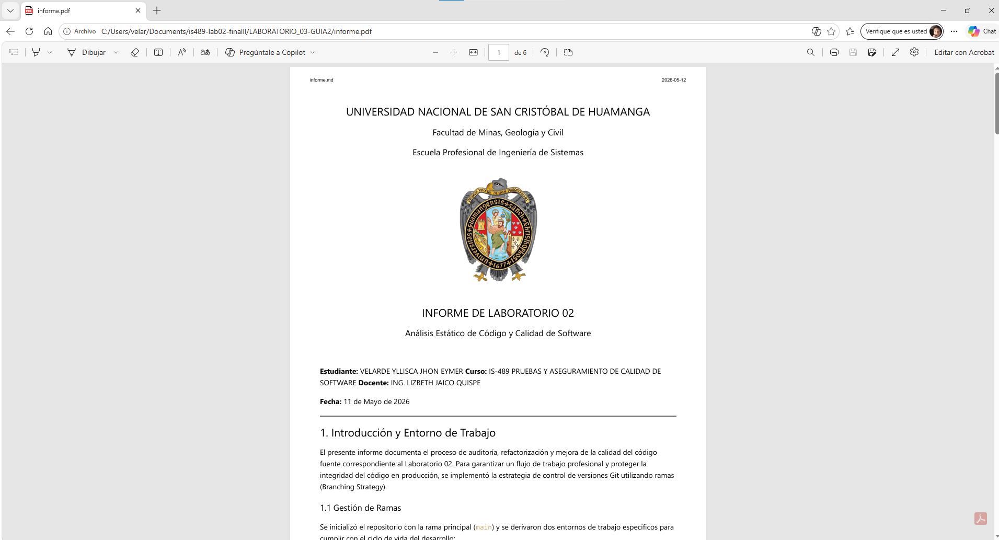

  
  
  ### UNIVERSIDAD NACIONAL DE SAN CRISTÓBAL DE HUAMANGA
  #### Escuela Profesional de Ingeniería de Sistemas
  
   
  
  # GUÍA DE EXPORTACIÓN: DOC A PDF
  ## Procedimiento de Documentación Técnica

 

**Información del Estudiante:**
* **Nombre:** Jhon Eymer Velarde Yllisca
* **Herramienta:** Visual Studio Code + Markdown PDF

---

## 1. Instalación de la Extensión
El primer paso consiste en preparar el entorno de Visual Studio Code con el motor de renderizado necesario.

  
  
<i>Figura 1: Interfaz de extensiones con Markdown PDF activo.</i>

## 2. Preparación del Archivo y Rutas
Es vital que las imágenes del informe principal no tengan caracteres especiales y estén en la ruta correcta.

  
  
<i>Figura 2: Organización de activos y archivo fuente en el proyecto.</i>

## 3. Previsualización y Exportación Final
Antes de generar el PDF, validamos el diseño con el visor integrado.

* **Previsualizar:** `Ctrl + Shift + V`
* **Exportar:** Clic derecho -> `Markdown PDF: Export (pdf)`

  
  
<i>Figura 3: Ejecución del comando de exportación a formato ISO PDF.</i>

---

## 4. Resultado Final
El proceso concluye con la generación de un archivo de lectura profesional que preserva el formato universitario.

  
  
<i>Figura 4: Documento final listo para la entrega en el aula virtual.</i>

 

  <i>"Ingeniería es el arte de organizar y dirigir a las personas y controlar las fuerzas y materiales de la naturaleza para el beneficio de la humanidad."</i>

