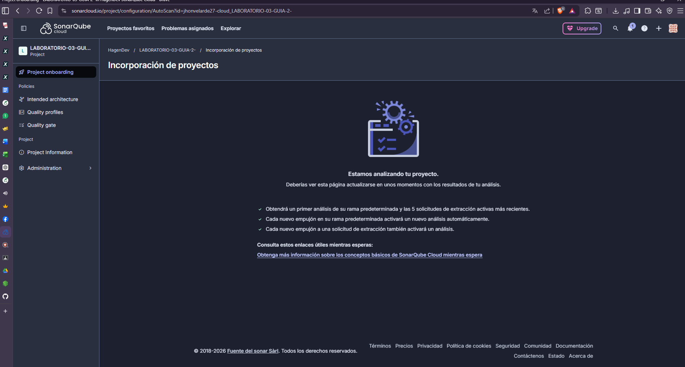
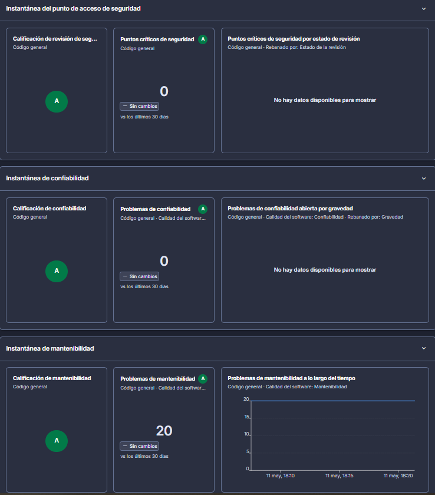
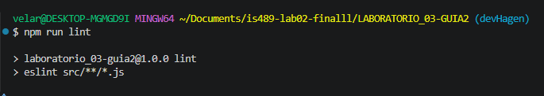
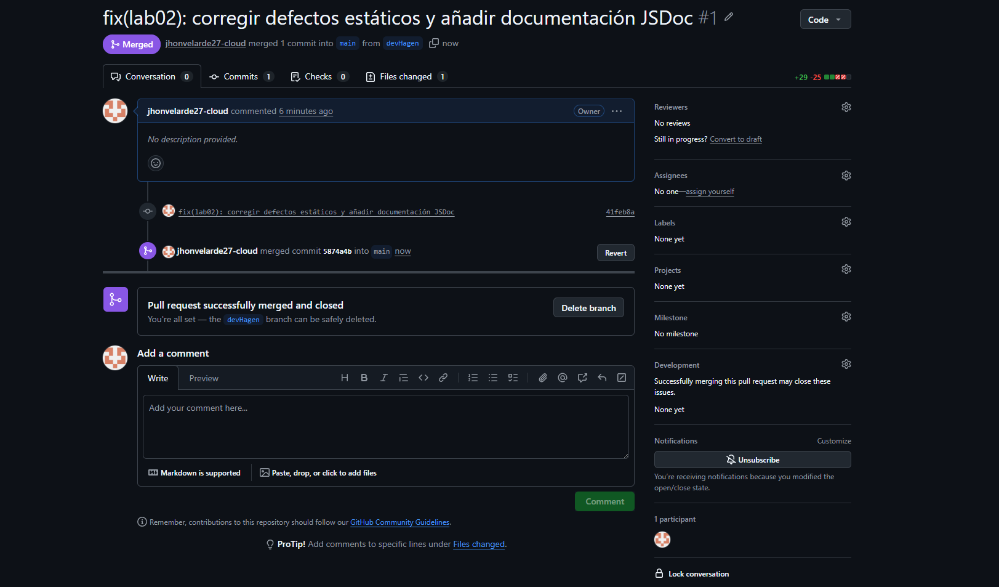
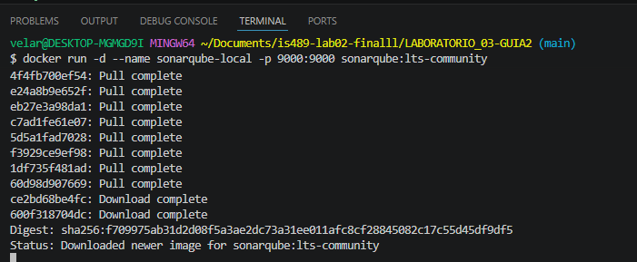
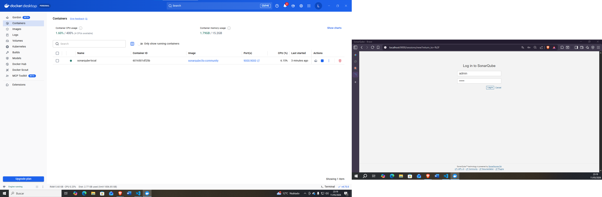
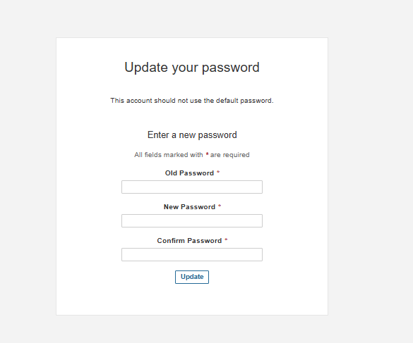
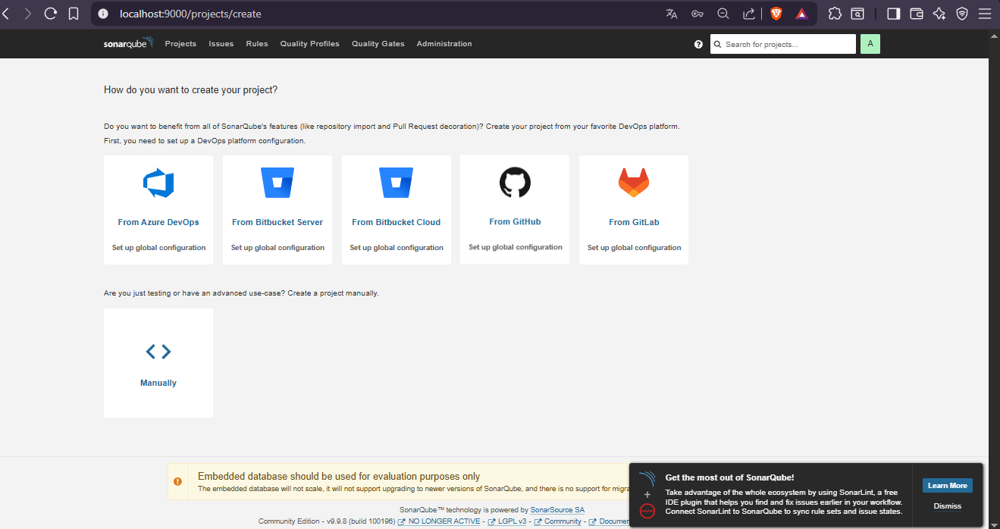

  <h2>UNIVERSIDAD NACIONAL DE SAN CRISTÓBAL DE HUAMANGA</h2>
  <h3>Facultad de Minas, Geología y Civil</h3>
  <h3>Escuela Profesional de Ingeniería de Sistemas</h3>
   
  
    
  <h2>INFORME DE LABORATORIO 02</h2>
  <h3>Análisis Estático de Código y Calidad de Software</h3>

 

**Estudiante:** VELARDE YLLISCA JHON EYMER
**Curso:** IS-489 PRUEBAS Y ASEGURAMIENTO DE CALIDAD DE SOFTWARE
**Docente:** ING. LIZBETH JAICO QUISPE
 
**Fecha:** 11 de Mayo de 2026  

---

## 1. Introducción y Entorno de Trabajo
El presente informe documenta el proceso de auditoría, refactorización y mejora de la calidad del código fuente correspondiente al Laboratorio 02. Para garantizar un flujo de trabajo profesional y proteger la integridad del código en producción, se implementó la estrategia de control de versiones Git utilizando ramas (Branching Strategy).

### 1.1 Gestión de Ramas
Se inicializó el repositorio con la rama principal (`main`) y se derivaron dos entornos de trabajo específicos para cumplir con el ciclo de vida del desarrollo:
* **`qaHagen` (Rama de Quality Assurance):** Destinada exclusivamente al análisis estático preliminar para identificar vulnerabilidades y *code smells* sin alterar el código principal.
* **`devHagen` (Rama de Desarrollo):** Entorno aislado donde se programaron las refactorizaciones, se aplicaron las reglas de linting y se implementó la documentación JSDoc.

---

## 2. Fase de Auditoría Inicial (Rama `qaHagen`)
En esta fase se sometió el código original (defectuoso) a herramientas de análisis estático para establecer una línea base de la deuda técnica.

### 2.1 Evidencia ESLint (.md) - Antes de Correcciones
La ejecución inicial del linter reveló múltiples infracciones a las buenas prácticas de ECMAScript 2021. 
* **Hallazgos:** 5 problemas detectados (4 advertencias por uso de variables globales `var` y 1 error crítico por el uso de comparadores débiles `==`).

  
  
<i>Figura 1: Terminal mostrando los errores detectados por ESLint en la rama qaHagen.</i>

### 2.2 Evidencia SonarCloud (.md) - Análisis en la Nube
El repositorio fue vinculado a SonarCloud para un análisis profundo. Este escaneo permitió identificar la deuda técnica acumulada y evaluar los pilares de calidad del software.

* **Métricas Obtenidas:** El dashboard reportó **20 cuestiones abiertas en Mantenibilidad** (Code Smells), afectando directamente la escalabilidad del código. Los índices de Seguridad y Fiabilidad se mantuvieron en categoría A.
* **Enlace al proyecto:** [Pega aquí la URL de tu proyecto público en SonarCloud]

  
  
<i>Figura 2: Dashboard general de SonarCloud evidenciando el estado inicial del proyecto.</i>

  
   
  
  
  
<i>Figura 3: Instantáneas detalladas de Seguridad, Confiabilidad y Mantenibilidad (20 Code Smells).</i>

* URL DE SONARCLOUD: https://sonarcloud.io/project/overview?id=jhonvelarde27-cloud_LABORATORIO-03-GUIA-2-

---

## 3. Fase de Refactorización y Corrección (Rama `devHagen`)
Con la deuda técnica identificada, se procedió a refactorizar el módulo `products.js` dentro del entorno de desarrollo.

### 3.1 Hallazgos y Soluciones Aplicadas
Se resolvieron los defectos detectados aplicando los siguientes criterios de calidad:
1. **Modernización de variables:** Se eliminó el uso de `var` (propensos a errores de *hoisting*) reemplazándolos estrictamente por `const` para estructuras inmutables.
2. **Comparaciones estrictas:** Se corrigió el error de validación `==` en la función de búsqueda, reemplazándolo por `===` para asegurar coincidencia de valor y tipo de dato.
3. **Validación de negocio:** Se inyectó lógica defensiva en la función `calculateDiscount` para arrojar un error (`throw new Error`) si el producto carece de precio, es nulo o tiene un valor negativo.
4. **Documentación JSDoc:** Se estandarizó la documentación de las funciones (`getProductById`, `calculateDiscount`, `filterExpensive`) describiendo sus parámetros `@param` y retornos `@returns`.

### 3.2 Evidencia ESLint (.md) - Después de Correcciones
Tras aplicar las soluciones, una nueva ejecución del linter confirmó la erradicación total de los defectos, cumpliendo con el estándar exigido en la configuración de `eslint.config.js`.

  
  
<i>Figura 3: Terminal limpia sin errores tras la refactorización en la rama devHagen.</i>

---

## 4. Integración y Despliegue (Merge a Main)
Al validar que la rama `devHagen` superó los controles de calidad (0 errores en el linter local), se procedió con la integración hacia la rama principal.

* **Proceso:** Se generó un Pull Request en GitHub comparando `devHagen` con `main`.
* **Resultado:** GitHub validó la ausencia de conflictos lógicos, permitiendo un *Merge automático* exitoso, consolidando el código limpio en producción.

  
  
<i>Figura 4: Confirmación del Pull Request exitoso y fusión a la rama main (Estado Merged).</i>

---

## 5. Checklist de Calidad (Definition of Done)
Para dar por concluido el laboratorio, se certifica el cumplimiento de los siguientes puntos:

- [x] Repositorio inicializado y estrategia de ramas implementada (`main`, `devHagen`, `qaHagen`).
- [x] Configuración de `eslint.config.js` y scripts de análisis en `package.json`.
- [x] Auditoría inicial: Ejecución de ESLint evidenciando 5 defectos originales.
- [x] Auditoría en la nube: Conexión y escaneo en SonarCloud (20 problemas métricos identificados).
- [x] Corrección de variables globales (`var` actualizados a `const`/`let`).
- [x] Corrección de comparadores no estrictos (`==` refactorizado a `===`).
- [x] Control
## 6. Implementación Local con Docker (SonarQube)
Para cumplir con los estándares de infraestructura y asegurar la portabilidad del entorno de QA, se desplegó una instancia local de SonarQube utilizando contenedores Docker sobre WSL 2.

### 6.1. Descarga y Despliegue de Imagen
Se utilizó la terminal para realizar el "pull" de la imagen oficial y levantar el contenedor en segundo plano.

  
  
<i>Figura 6: Descarga de capas de la imagen sonarqube:lts-community desde Docker Hub.</i>

### 6.2. Gestión de Contenedores
Validación del estado del contenedor desde el Dashboard de Docker Desktop, confirmando el mapeo del puerto 9000.

  
  
<i>Figura 7: Monitorización del contenedor 'sonarqube-local' activo y consumo de recursos.</i>

### 6.3. Configuración de Seguridad
Acceso inicial al servidor local y actualización obligatoria de las credenciales de administrador (Protocolo de seguridad de SonarQube).

  
  
<i>Figura 8: Interfaz de actualización de contraseñas tras el primer despliegue.</i>

### 6.4. Dashboard Operativo
Panel principal de SonarQube listo para la creación de proyectos manuales o integración con DevOps platforms.

  
  
<i>Figura 9: Servidor local operativo y listo para el análisis estático de código.</i>

